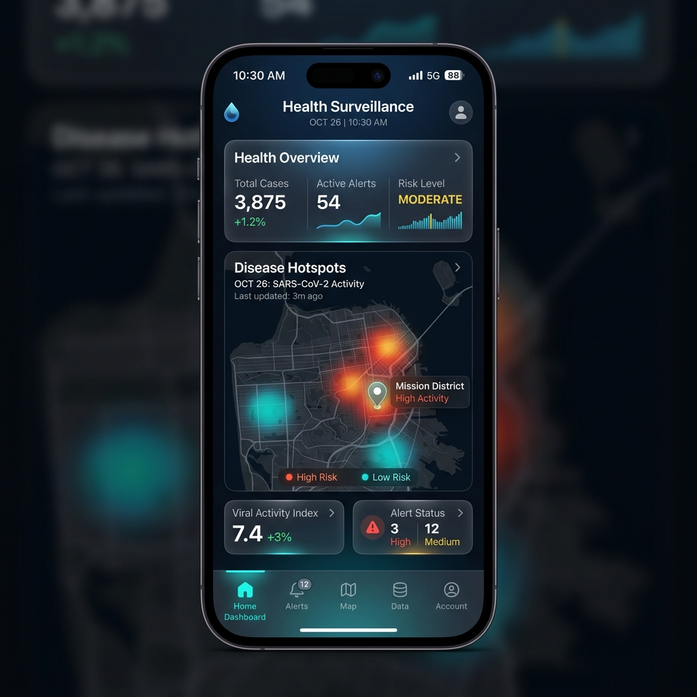

# 🏥 HealthDrop Surveillance System

[](https://expo.dev/)
[](https://reactnative.dev/)
[](https://www.typescriptlang.org/)
[](https://supabase.com/)

HealthDrop is an advanced, AI-powered disease surveillance and public health management platform. Built with a "Liquid Glass" design philosophy, it provides health workers and administrators with real-time insights, interactive risk mapping, and seamless communication tools to manage public health crises effectively.

---

## ✨ Project Preview



---

## 🚀 Key Features

- **📊 Real-time Dashboard**: Live monitoring of national and regional health statistics with interactive data visualization.
- **🗺️ Interactive Risk Mapping**: Heatmaps and facility mapping using Leaflet and Google Maps to identify and manage hotspots.
- **🛡️ AI Risk Analysis**: Regional risk assessments with detailed explanatory panels driven by predictive logic.
- **🩺 Community Reporting**: Tools for field workers and citizens to report health incidents in real-time.
- **🏥 Telemedicine & Education**: Integrated virtual consultation modules and a library of hygiene education resources.
- **🌓 Liquid Glass UI**: A premium, frosted-glass aesthetic with full support for dynamic light and dark modes.
- **🔐 Secure Authentication**: Integrated profile management and secure session handling (Supabase ready).

---

## 🛠️ Technology Stack

- **Frontend**: React Native with Expo SDK 54
- **Styling**: Custom Design System with Expo Blur & Glassmorphism
- **Navigation**: Custom modular navigation architecture
- **Maps**: Leaflet, React Native Maps, Google Maps API
- **Backend**: Supabase (Authentication & Data Integration)
- **Utilities**: Async Storage, Expo Location, Crypto, Secure Store

---

## 📂 Project Structure

```text
├── App.tsx                 # Core application entry & theme provider
├── components/             # Reusable UI components (Cards, Maps, Auth)
├── pages/                  # Main application screens
│   ├── IndexPage.tsx       # Main dashboard
│   ├── NationalStats.tsx   # Global & Local analytics
│   ├── CommunityReport.tsx # Field incident reporting
│   └── Telemedicine.tsx    # Remote health consultation
├── lib/                    # State management (Context) & Utilities
├── assets/                 # Branding assets and visual resources
└── types/                  # Type-safe interfaces
```

---

## ⚙️ Getting Started

### Prerequisites

- [Node.js](https://nodejs.org/) (v18+)
- [Expo CLI](https://docs.expo.dev/get-started/installation/)
- [Expo Go](https://expo.dev/client) app (for physical device testing)

### Installation

1. **Clone the repository**:
   ```bash
   git clone https://github.com/nijjukrr/HEALTH-SURVEY-SYSTEM.git
   cd HEALTH-SURVEY-SYSTEM
   ```

2. **Navigate to project directory**:
   ```bash
   cd HEALTH-SURVEY-SYSTEM-main
   ```

3. **Install dependencies**:
   ```bash
   npm install
   ```

4. **Start the development server**:
   ```bash
   npx expo start
   ```

---

## 🤝 Contributing

We welcome contributions to improve the HealthDrop platform! 

1. Fork the Project
2. Create your Feature Branch (`git checkout -b feature/AmazingFeature`)
3. Commit your Changes (`git commit -m 'Add some AmazingFeature'`)
4. Push to the Branch (`git push origin feature/AmazingFeature`)
5. Open a Pull Request

---

## 📄 License

This project is proprietary. © 2024 HealthDrop Surveillance. All rights reserved.

---

<p align="center">
  Built with ❤️ for a Healthier World
</p>
